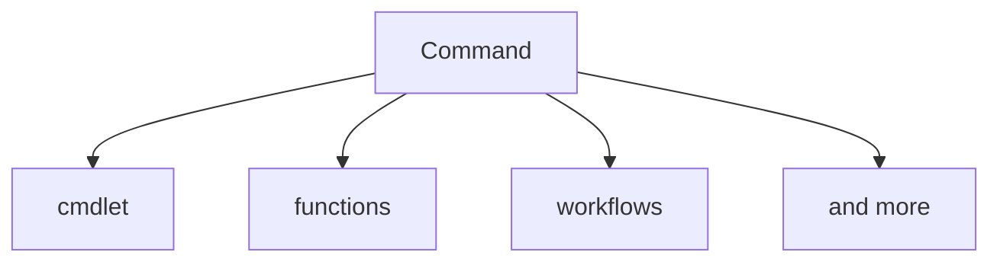

https://docs.microsoft.com/en-us/powershell/scripting/learn/ps101/02-help-system?view=powershell-7.2

## discover commands

Compiled commands in PowerShell are called cmdlets. 
Cmdlets names have the form of singular "Verb-Noun" commands to make them easily discoverable.

### The Three Core Cmdlets in PowerShell:  
- **Get-Help ->  helps you learn how to use commands once you find them.**  
  - [Get-help examples](/01_Help-System/00_get-help.ps1)
- **Get-Command**  
- **Get-Member**  

