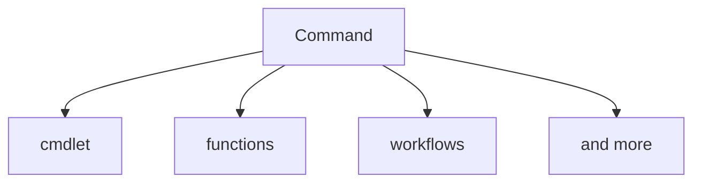
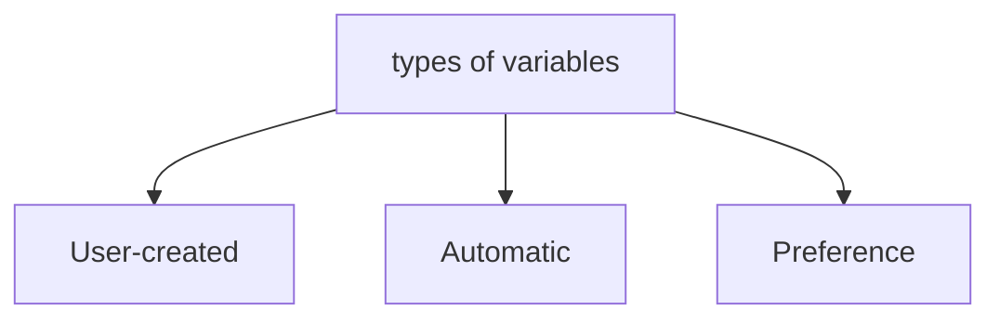
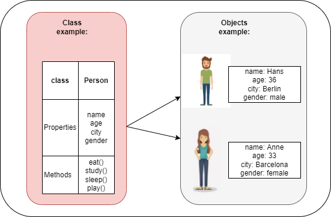
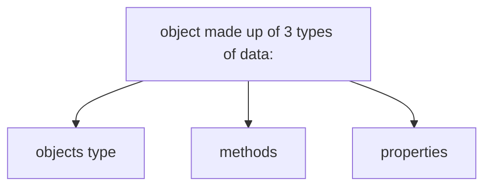

# Learn Powershell

## 00 - Getting Started

### Prepare your environment
#### Install Software
install the following software:  
recommendation: use a package manager like [winget](https://docs.microsoft.com/en-us/windows/package-manager/winget/) for example  
- vscode
- Windows Terminal
- git
- Powershell 7 

["Script" to install the mentioned software above with winget](00_GettingStared/../00_GettingStarted/InstallSoftware.ps1)  

[Script to use winget in a Windows Sandbox](00_GettingStared/../00_GettingStarted/Demo/winget-sandbox.ps1)  

#### Create your personal Github Account with a Repository

- create your own Github account https://github.com/
- create your first repo, clone it and open it in vscode https://docs.github.com/en/get-started/quickstart/hello-world#creating-a-repository
- login to vscode with your github account
- install powershell extension in vscode https://code.visualstudio.com/docs/languages/powershell
- optional: synchronize your vscode settings, extensions with your github account

### Check your Powershell Version
Check which Powershell version you are using:  

[00_PSVersion](00_GettingStared/../00_GettingStarted/00_PSVersion.ps1)

### Execution Policy
It's designed to prevent a user from unknowingly running a script.  

[01_Executionpolicy](00_GettingStared/../00_GettingStarted/01_Executionpolicy.ps1)

### Run Powershell as admin
RUNNING POWERSHELL AS ADMINISTRATOR At times it’s necessary to run the PowerShell console as Administrator. This typically happens when you need to modify files, the registry, or anything else that’s outside your user profile.  You can run PowerShell as an Administrator by right-clicking in Windows PowerShell and then clicking Run as Administrator.

## 01 - Help System

### The Three Core Cmdlets in PowerShell:  
- **Get-Help ->  helps you learn how to use commands once you find them.**  
  - [Learn how to use Get-help](/01_Help-System/00_get-help.ps1)
- **Get-Command**  
  - [Learn how to use Get-command](/01_Help-System/01_get-command.ps1)
- **Get-Member (in another chapter)**  

### discover commands

Compiled commands in PowerShell are called cmdlets. 
Cmdlets names have the form of singular "Verb-Noun" commands to make them easily discoverable.
Command is a more general class which includes for example functions as well:

[Microsoft Docs - Help System](https://docs.microsoft.com/en-us/powershell/scripting/learn/ps101/02-help-system?view=powershell-7.2)

### LAB
[LAB - Help System](/01_Help-System/lab-help-system.md)  
[LAB - Help System answers](01_Help-System/z_lab-answers-help-system.md)

## 02 - Variables
A variable is a unit of memory in which values are stored.  
In PowerShell, variables are represented by text strings that begin with a dollar sign ($), such as $a, $process, or $my_var.  
You can find examples of variables and how to work with them here:  
[Learn variables](/02_Variables/00_Var.ps1)

[About_variables - Microsoft Docs](https://docs.microsoft.com/en-us/powershell/module/microsoft.powershell.core/about/about_variables?view=powershell-7.2)  
[Language specifications - Variables](https://docs.microsoft.com/en-us/powershell/scripting/lang-spec/chapter-05?view=powershell-7.2)

### LAB
[LAB - Variables](/02_Variables/LAB_Variables.md)    
[LAB - Variables answers](/02_Variables/z_lab-answers-variables.md)
## 03 - Data Types
Powershell can figure out data types based on the values you provide.  

- [Boolean Values (true or false)](03_DataTypes/00_boolean.ps1)
- [Integers and Floating Points](03_DataTypes/01_int-float.ps1)
  - Integer Types
    - int - 32 bits (-2147483648 to +2147483647)
    - long - 64 bits ( -9223372036854775808 to +9223372036854775807)
  - Floating-Point Types
    - Float and Double
- [Strings](03_DataTypes/02_strings.ps1)
  - combining strings and Variables
  - using doubles vs. single quotes

[Language specifications - Types](https://docs.microsoft.com/en-us/powershell/scripting/lang-spec/chapter-04?view=powershell-7.2)

## 04 - Objects
In PowerShell - everything is an object. An object is an instance of a class.  
The class determins methods, properties, actions.  

An example of a class and objects  

- [Objects](04_Objects/00_objects.ps1)
  - properties
  - get-member
  - Calling methods

Links:  
[Microsoft Docs - Discovering objects, properties and methods](https://docs.microsoft.com/en-us/powershell/scripting/learn/ps101/03-discovering-objects?view=powershell-7.2)  
[Microsoft Docs - about Objects](https://docs.microsoft.com/en-us/powershell/module/microsoft.powershell.core/about/about_objects?view=powershell-7.2)  

### LAB
[LAB - Objects](/04_Objects/LAB_objects.md)  
[LAB - Objects answers](04_Objects/z_LAB-answers-objects.md)

## 05 - Data structures
From Wikipedia:   
"In computer science, a data structure is a data organization, management, and storage format that enables efficient access and modification. More precisely, a data structure is a collection of data values, the relationships among them, and the functions or operations that can be applied to the data, i.e., it is an algebraic structure about data."  

  
 

### Arrays
If you imagine a int variable as a simple box then an array is a lot of boxes taped together.
In other Word an array is a list of items represented by a single variable

[Learn Arrays](/05_DataStructures/00_Arrays.ps1)

Links:  
[Microsoft Docs about_Arrays](https://docs.microsoft.com/en-us/powershell/module/microsoft.powershell.core/about/about_arrays?view=powershell-7.2)  
[Everything you wanted to know about arrays](https://powershellexplained.com/2018-10-15-Powershell-arrays-Everything-you-wanted-to-know/)  

### ArrayLists
We learned that Arrays in PowerShell have a fixed size. If you want to add additional items to the array it always creates a new array.  
This can have a huge impact on performance especially if you are working with many elements.  
Use ArrayList if you know you have to remove or add many elements to an array.  
In ArrayLists it is possible to add and remove elements and therefore it is much faster.  
Note: PowerShell is accessing .Net to get this type.  

[Learn ArrayLists](/05_DataStructures/01_ArrayLists.ps1)

### Hashtables
A hashtable is a data structure, much like an array, except you store each value (object) using a key. It's a basic key/value store.  
[Learn Hashtables](/05_DataStructures/02_Hashtables.ps1)

Links:  
[Microsoft Docs about_Hash_Tables](https://docs.microsoft.com/en-us/powershell/module/microsoft.powershell.core/about/about_hash_tables?view=powershell-7.2)  
[Everything you wanted to know about hashtables](https://docs.microsoft.com/en-us/powershell/scripting/learn/deep-dives/everything-about-hashtable?view=powershell-7.2)  

### Custom Objects  
You can create custom objects with properties and methods that you define.  

[Learn Custom Objects](/05_DataStructures/03_CustomObjects.ps1)

Links:  
[Everything you wanted to know about PSCustomObject](https://docs.microsoft.com/en-us/powershell/scripting/learn/deep-dives/everything-about-pscustomobject?view=powershell-7.2)  
[Microsoft Docs about_PSCustomObject](https://docs.microsoft.com/en-us/powershell/module/microsoft.powershell.core/about/about_pscustomobject?view=powershell-7.2)  

## 06 - Pipeline
The PowerShell pipeline allows you to send the output of one command directly into another command as input.  

[Learn PowerShell Pipeline](/06_Pipeline/00_Pipeline.ps1)  

  