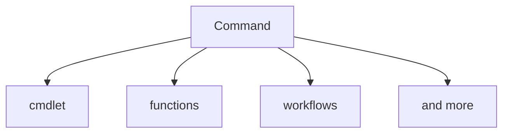

# Learn Powershell

## 00 - Getting Started

### Prepare your environment
#### Install Software
install the following software:  
recommendation: use a package manager like [winget](https://docs.microsoft.com/en-us/windows/package-manager/winget/) for example  
- vscode
- Windows Terminal
- git
- Powershell 7 

[Script to use winget in a Windows Sandbox](00_GettingStared/../00_GettingStarted\Demo\winget-sandbox.ps1)  
[Script to install the mentioned software above with winget](00_GettingStared/../00_GettingStarted/InstallSoftware.ps1)  
#### Create your personal Github Account with a Repository

- create your own Github account https://github.com/
- create your first repo, clone it and open it in vscode https://docs.github.com/en/get-started/quickstart/hello-world#creating-a-repository
- login to vscode with your github account
- install powershell extension in vscode
- optional: synchronize your vscode settings, extensions with your github account

### What version of PowerShell am I running?
Check which Powershell version you are using:  

[00_PSVersion](00_GettingStared/../00_GettingStarted/00_PSVersion.ps1)

### Execution Policy
It's designed to prevent a user from unknowingly running a script.  

[01_Executionpolicy](00_GettingStared/../00_GettingStarted/01_Executionpolicy.ps1)

### Run Powershell as admin
RUNNING POWERSHELL AS ADMINISTRATOR At times it’s necessary to run the PowerShell console as Administrator. This typically happens when you need to modify files, the registry, or anything else that’s outside your user profile.  You can run PowerShell as an Administrator by right-clicking in Windows PowerShell and then clicking Run as Administrator.

## 01 - Help System

https://docs.microsoft.com/en-us/powershell/scripting/learn/ps101/02-help-system?view=powershell-7.2

### The Three Core Cmdlets in PowerShell:  
- **Get-Help ->  helps you learn how to use commands once you find them.**  
  - [Get-help examples](/01_Help-System/00_get-help.ps1)
- **Get-Command**  
  - [Get-command examples](/01_Help-System/00_get-command.ps1)
- **Get-Member (in another chapter)**  

### discover commands

Compiled commands in PowerShell are called cmdlets. 
Cmdlets names have the form of singular "Verb-Noun" commands to make them easily discoverable.

### LAB
[LAB - Help System](01_Help-System\lab-help-system.md)
